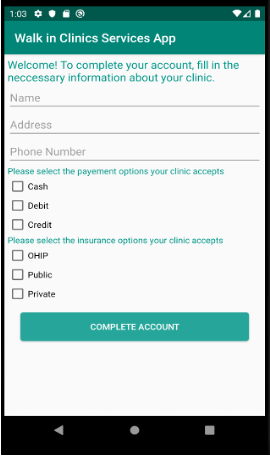
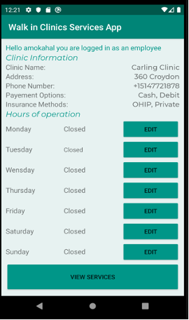
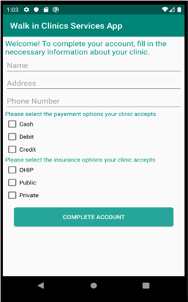
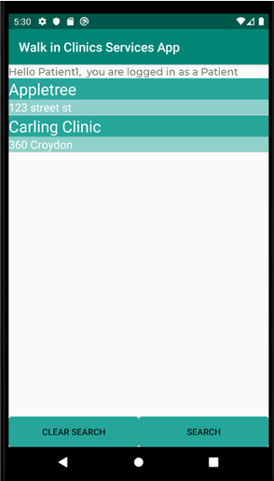
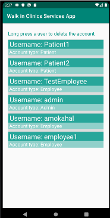
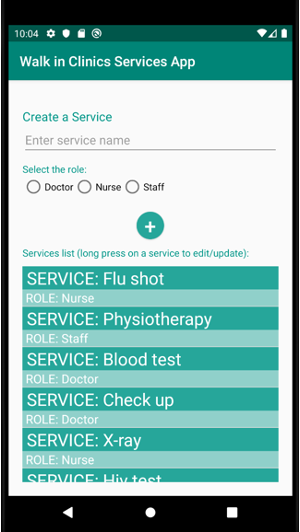

# Walk-in Clinics App

### Android mobile application for walk-in clinics to display services, wait times, and provide a booking system for their customers.

### 🔗 [**Presentation Slides**](https://docs.google.com/presentation/d/1NsODQV6O1zj7DgmCZ33pduZRzQ4Jyx0O/edit?usp=sharing&ouid=111022835539578237279&rtpof=true&sd=true)

### Built using

- `Java`
- `AndroidStudio`
- `Firebase`

### Features

- User login and authentication to store customer and clinic credentials.
- Allows customers to search for walk-in clinics nearby.
- Walk-in clinic profiles to display opening hours, wait times, clinic services, and costs.
- Allows customers to book a time slot for a service to be performed.

### Screens

  
  
  

  
  
  

  
  
  

